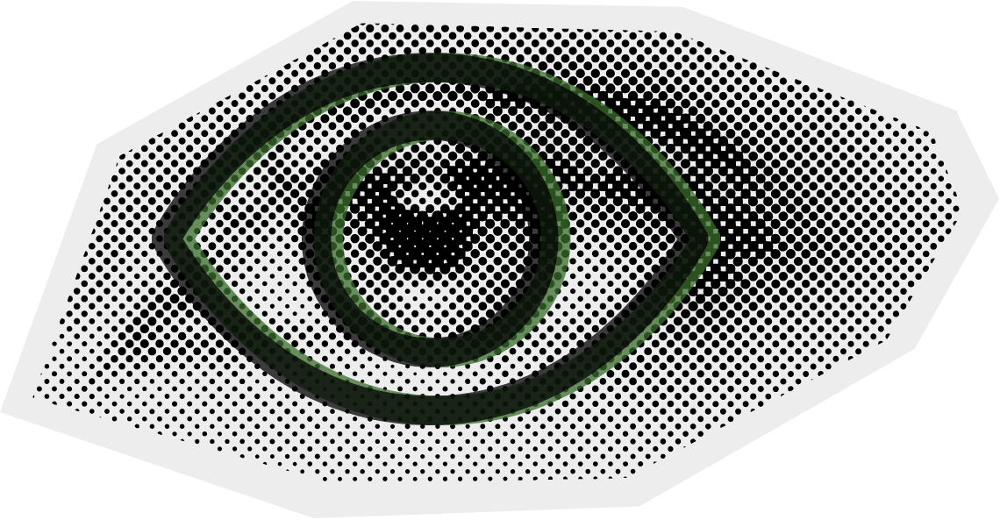

<p align="center">
  
</p>

<h1 align="center">Kareem</h1>

<p align="center">
  <b>Kareem keeps an eye on your agent's context.</b><br>
  A tiny trained policy that watches an autonomous agent's context every step and tells the harness
  <b>when to compact, prune, or re-inject instructions</b> — one forward pass, under a millisecond, CPU-only.
</p>

---

Every long-running agent hits the same wall: the context fills with stale tool output, the original instructions lose salience, error streaks compound, and eventually the model overflows or quietly degrades. Today most harnesses handle this with a hand-written threshold ("compact at 90%"). Kareem replaces that guess with a policy trained by an autonomous research factory over 100 experiments, selected on held-out scenarios, and confirmed on a hidden set that was never used for selection.

## Measured performance (simulator)

Scores on a scale where a clairvoyant planner that sees the future = 100. The estimated ceiling for any observation-only policy is ~83.

| Policy | Eval (200 scenarios) | Hidden confirmation (200 scenarios) |
|---|---|---|
| Do nothing | 0.0 | — |
| Hand-written threshold heuristic | 50.0 | — |
| Claude-teacher distill | — | 73.8 |
| Rule-teacher distill | — | 75.7 |
| **Kareem (3-member MLP ensemble)** | **81.5** | **81.4** |

Full protocol: [ai_docs/benchmark_protocol.md](ai_docs/benchmark_protocol.md) and [BENCHMARKS.md](BENCHMARKS.md). Every experiment, judge score, and selection decision is in `experiments/` and auditable.

## Install

```bash
pip install -e .          # only dependency: torch
```

## Quickstart

```python
import kareem

agent = kareem.load_policy()                  # bundled weights
tracker = kareem.SessionTracker(capacity_tokens=200_000)

for step in agent_steps:                      # your agent loop
    obs = tracker.observe(
        tokens_used=count_tokens(context),    # real token counts; units handled internally
        tool_tokens=tool_output_tokens(context),
        last_error=step_failed,               # tool/test/command failure this step
        last_success=step_succeeded,
        progress=subtasks_done,
    )
    decision = agent.decide(tracker.history, min_confidence=0.35)
    if not decision.deferred:
        apply_intervention(decision.action)   # your harness implements the six actions
        tracker.applied(decision.action)
    else:
        tracker.applied(kareem.Action.NOOP)
```

`decision` carries `action` (enum), `confidence`, and the full `probabilities` dict. Note on thresholds: confidence is a 6-way softmax trained with soft targets, so typical max-prob is 0.3–0.4 — pick `min_confidence` from a shadow-log sweep (below), not by intuition.

## The six actions

| Action | What your harness should do |
|---|---|
| `NOOP` | nothing |
| `COMPACT` | summarise the conversation, replace with the summary; clears the error streak |
| `PRUNE_TOOLS` | drop old tool outputs, keep the most recent |
| `REINJECT_INSTRUCTIONS` | re-append the system prompt / task instructions; halves the error streak |
| `CHECKPOINT_RESET` | fresh context seeded with a checkpoint summary (rarely chosen) |
| `RETRIEVE_MEMORY` | pull facts from long-term memory / notes / RAG back in |

## Claude Code integration (shadow/recommend mode)

Works today via [hooks](https://code.claude.com/docs/en/hooks) — no modification to Claude Code. Add to `.claude/settings.json`:

```json
{
  "hooks": {
    "SessionStart":       [{"hooks": [{"type": "command", "timeout": 10, "command": "python -m kareem.integrations.claude_code_hook"}]}],
    "PostToolUse":        [{"matcher": "*", "hooks": [{"type": "command", "timeout": 10, "command": "python -m kareem.integrations.claude_code_hook"}]}],
    "PostToolUseFailure": [{"matcher": "*", "hooks": [{"type": "command", "timeout": 10, "command": "python -m kareem.integrations.claude_code_hook"}]}]
  }
}
```

What it does: reads real context usage from the transcript, tracks per-session state, logs every decision to `~/.kareem/shadow/`, and when the policy is confident, injects a recommendation into Claude's context (e.g. "finish this step, then /compact"). Hooks **cannot** trigger compaction themselves — this is recommend-only by design. For real actuation, use the Agent SDK wrapper below.

Overhead: the common path is pure stdlib; torch loads only once utilization crosses `KAREEM_MIN_UTIL` (default 0.25) or an error streak forms. Config via env vars: `KAREEM_DISABLED`, `KAREEM_CAPACITY_TOKENS`, `KAREEM_MIN_CONFIDENCE`, `KAREEM_MIN_UTIL`, `KAREEM_STATE_DIR`.

After a few sessions, tune the threshold from real data:

```bash
kareem-shadow report ~/.kareem/shadow/<session>.jsonl
```

prints the action histogram, confidence distribution, and a threshold sweep ("at min_confidence 0.35 the policy would have intervened on 12% of steps").

### Full actuation via the Agent SDK

When you own the loop, the policy can act instead of recommend. `GuardedAgent` wraps the [Claude Agent SDK](https://docs.anthropic.com/en/docs/agent-sdk/python) (`pip install claude-agent-sdk`, or `pip install -e ".[claude]"`):

```python
from claude_agent_sdk import ClaudeAgentOptions
from kareem.integrations.claude_agent import GuardedAgent

async with GuardedAgent(
    options=ClaudeAgentOptions(allowed_tools=["Read", "Bash"], cwd="."),
    instructions="<original task instructions>",   # used by REINJECT_INSTRUCTIONS
    memory=fetch_relevant_notes,                   # used by RETRIEVE_MEMORY
    min_confidence=0.35,
) as agent:
    async for msg in agent.run_turn("Fix the failing test in parser.py"):
        ...
```

Actuation per action: `REINJECT_INSTRUCTIONS` prepends the original instructions to the next prompt; `RETRIEVE_MEMORY` prepends your memory source's content; `COMPACT`/`CHECKPOINT_RESET` ask the live session for a continuation summary, then start a fresh session seeded with it (the SDK can't edit a live session's history, so compaction = checkpoint + new session); `PRUNE_TOOLS` degrades to a don't-re-read-old-outputs instruction — the one action the SDK can't truly perform.

## Caveats (read before deploying)

- **Trained on synthetic telemetry.** The simulator's dynamics (salience decay, compaction loss, overflow) are a model of real agents, not measurements. Expect a sim-to-real gap — hence shadow-first.
- **Units and scale matter.** Trained at 128k capacity, 40-step sessions. Rescale `capacity`/`horizon` to comparable units if your setup differs wildly, or retrain.
- **Confidence is diffuse by design** (soft-target distillation). Use the threshold sweep, not gut feel.
- **Retraining with real data** is the production path: record real sessions in the observation schema, build labels, rerun the factory's training protocol.

## How it was made

Kareem is the artifact; the **factory** is what produced it — an autonomous pipeline of LLM agents (Meta proposes experiments → Worker writes `model.py` → deterministic simulator trains/evaluates → Judge scores → Router escalates model effort) that ran 100 experiments over 10 iterations with a hidden confirmation set to prevent selection drift.

Documentation ladder, least to most technical:

1. [specs/optimizer/factory_explained.pdf](specs/optimizer/factory_explained.pdf) — the system as a cooking-show story
2. [specs/optimizer/factory_flows.pdf](specs/optimizer/factory_flows.pdf) — plain-language state diagrams
3. [specs/optimizer/factory_pipeline.pdf](specs/optimizer/factory_pipeline.pdf) — technical walkthrough of the state machines
4. [specs/optimizer/factory_visualization.pdf](specs/optimizer/factory_visualization.pdf) — the full atlas
5. [workspace/deploy/research_paper.md](workspace/deploy/research_paper.md) — experiment-by-experiment account

## Repo layout

```
kareem/               the product: runtime, weights, observation adapters, shadow tooling
  weights/            intervention_policy.pt + policy_model.py + policy_card.json
  integrations/       claude_code_hook.py (shadow/recommend) + claude_agent.py (actuation)
factory/              the machine that made it (agents, router, simulator, wave executor)
specs/optimizer/      master spec, benchmark protocol, docs ladder (PDFs)
ai_docs/              agent-facing contracts (simulator contract, schemas)
experiments/          run archives (gitignored — runtime output)
workspace/            factory output: reports, deploy bundle (gitignored)
```

## License

Apache-2.0. See [LICENSE](LICENSE).
